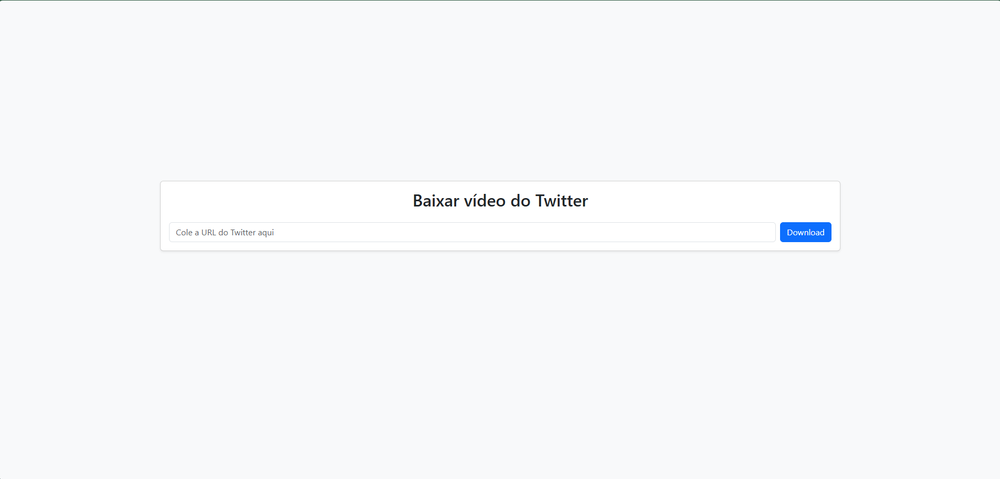

# 📥 Baixador de Vídeos do Twitter

🔗 [Acesse o aplicativo online](https://baixavideotwitter.onrender.com)

Aplicativo **Flask** para baixar vídeos do Twitter, hospedado gratuitamente no **Render**.  
Simples, rápido e acessível via navegador.
